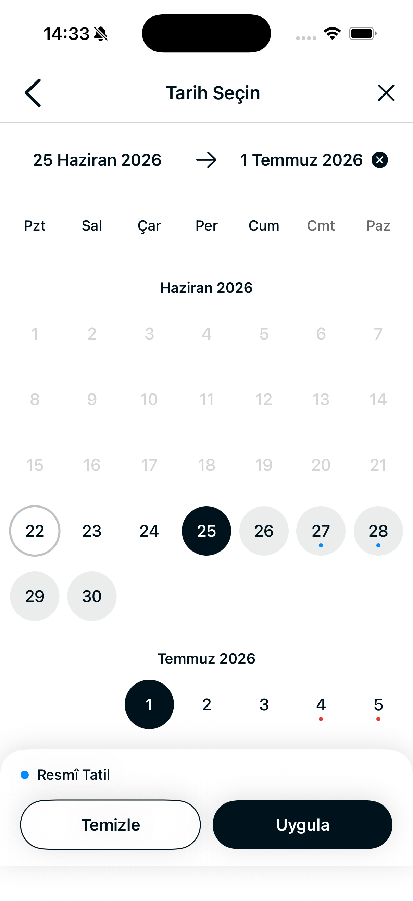
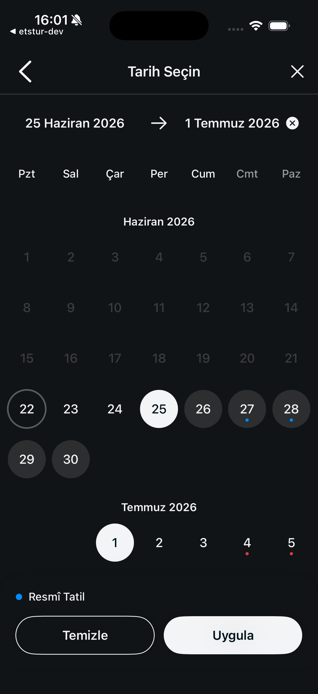
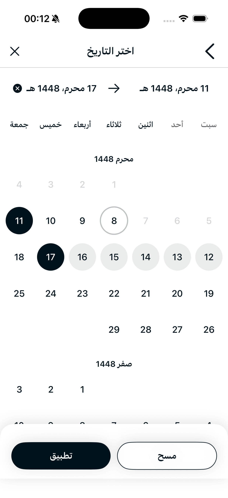
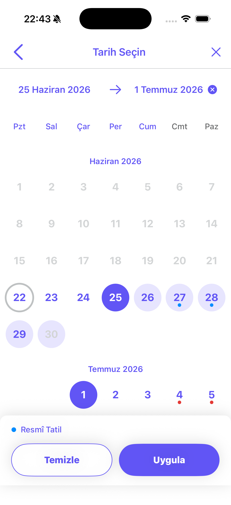
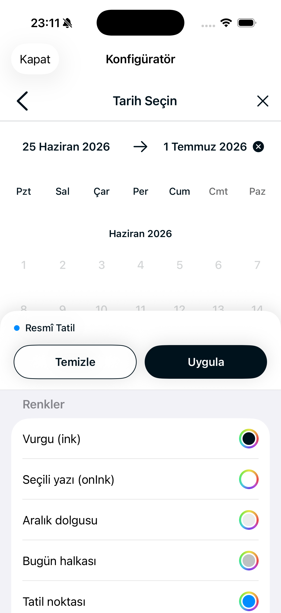
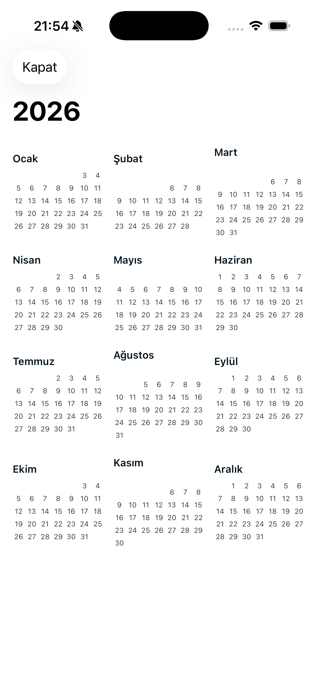
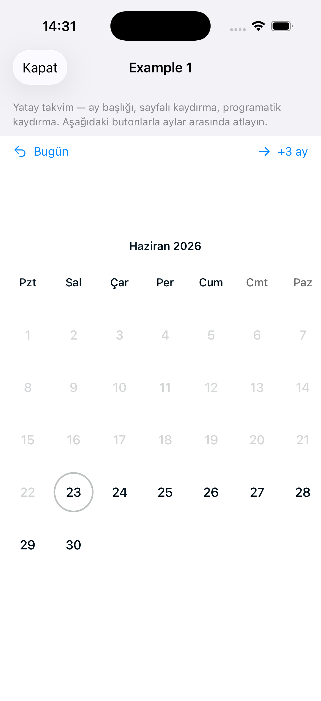
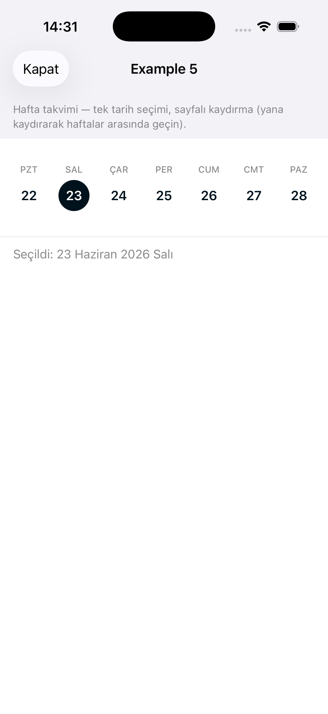
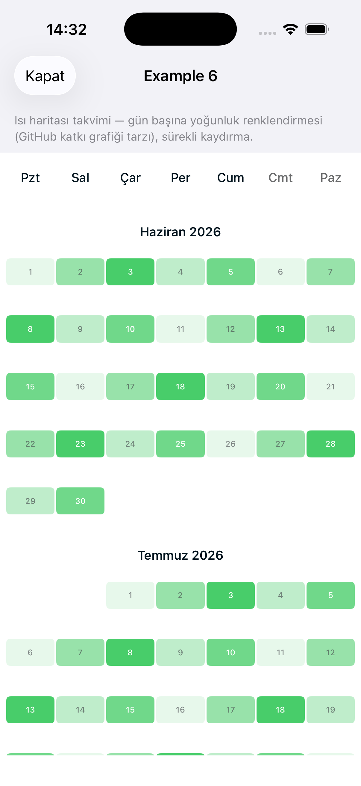
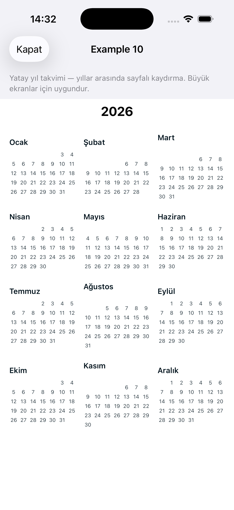

<div align="center">

# Almanac

**A fully-configurable SwiftUI date-range calendar for iOS** — range & single selection, holidays,
price badges, dark mode, RTL, any `Calendar` (Gregorian, Hijri…), week / month / year layouts with
year ↔ month browsing, theme presets, and a live design configurator.

[](https://swiftpackageindex.com/isamercan/Almanac)
[](https://swiftpackageindex.com/isamercan/Almanac)
[](https://swift.org/package-manager/)
[](LICENSE)
[](https://github.com/isamercan/Almanac/actions)

<table>
  <tr>
    <td></td>
    <td></td>
    <td></td>
  </tr>
  <tr>
    <td></td>
    <td></td>
    <td></td>
  </tr>
</table>

</div>

## Why Almanac?

| | Almanac | HorizonCalendar | OBCalendar | FSCalendar |
|---|:---:|:---:|:---:|:---:|
| SwiftUI-native | ✅ | ✅ | ✅ | ❌ (UIKit) |
| Range selection built-in | ✅ | manual | ✅ | manual |
| Domain logic (min/max nights, blocked days, price badges) | ✅ | ❌ | ❌ | ❌ |
| Full design config (one `CalendarStyle`) | ✅ | per-item | modifiers | partial |
| Day-cell composition (`.calendarDay`) | ✅ | ✅ | ✅ | limited |
| Dark mode · Dynamic Type · Reduce Motion · VoiceOver | ✅ | partial | partial | partial |
| RTL + non-Gregorian calendars | ✅ | ✅ | partial | partial |
| Live in-app design configurator → copyable Swift | ✅ | ❌ | ❌ | ❌ |
| Drum time picker included | ✅ | ❌ | ❌ | ❌ |

Built on the battle-tested [HorizonCalendar](https://github.com/airbnb/HorizonCalendar) engine, with a
travel-domain feature set and a complete theming/composition layer on top.

## Installation

Swift Package Manager — in Xcode, *File ▸ Add Package Dependencies…* and enter the repo URL, or add to
`Package.swift`:

```swift
.package(url: "https://github.com/isamercan/Almanac.git", from: "0.1.0")
```

Then add `"Almanac"` to your target's dependencies and `import Almanac`.
Requires **iOS 17+**. (SPM only — resources use `Bundle.module`; CocoaPods is not supported.)

## Layout

```
.
├── Package.swift            # the library (repo-root Swift package)
├── Sources/Almanac/         # Public · Screen · Components · Wheel · Model · Theme · Common · Resources
├── Tests/AlmanacTests/
└── Demo/                    # runnable example app
    ├── calendar-ios.xcodeproj
    ├── CalendarDemo/
    └── CalendarDemoUITests/
```

## Features

Everything beyond plain range selection is additive and opt-in — the stock defaults stay pixel-stable
(the snapshot suite enforces this):

- **Dark mode + full design config** — adaptive colors plus one comprehensive `CalendarStyle`
  (`theme` colors + `typography` + `metrics`: sizes, spacings, radii, animation, line widths),
  injected with `.calendarStyle(_:)`; `.calendarTheme(_:)` is a colors-only shortcut. Ships named
  palettes too — `CalendarThemePreset` (`.ocean`, `.sunset`, `.forest`, `.midnight`) on top of `.standard`.
- **Accessibility** — VoiceOver labels on day cells (date + state) and adjustable time wheels;
  Dynamic Type scaling; Reduce Motion support.
- **State restoration** — opt-in `@SceneStorage` persistence via `restorationID`.
- **Travel features** — blocked dates, per-day price badges, min/max nights, single-date mode,
  hotel / rent-a-car top-bar titles.
- **Ergonomic API** — `.calendarRangePicker(isPresented:…)` sheet modifier, `async`
  `CalendarPickerHosting.present(…)`, and an `AsyncStream` of live selection changes.
- **RTL + locales** — tr (default), en, ar (right-to-left).
- **Composability** — bring-your-own views via `.calendarDay`, `.calendarMonthHeader`,
  `.calendarWeekdayHeader`, `.calendarLegend`, `.calendarSelectedDateAccessory` (fed a public
  `CalendarDayContext` / the selected day).
- **Layout & navigation** — vertical or **horizontal paging**, configurable first weekday (via the
  injected `Calendar`), hideable weekday header / legend, programmatic `CalendarController.scroll(to:)`,
  an opt-in **"jump to today"** button, a paged **`CalendarWeekView`** week strip, a single- or
  multi-year `CalendarYearView` overview, and `CalendarBrowseView` for full **year ↔ month**
  navigation (tap a month to zoom into the grid). The week/month/year views share one selection
  engine, so holidays, prices, blocked days and min/max nights behave identically across them.
- **Configurable chrome** — `CalendarChrome` toggles each surrounding part independently (title bar,
  date row, weekday header, legend, footer, Clear / Apply buttons, Today button). `.full` = stock
  picker, `.none` = bare grid, or any mix. Plus `CalendarGridView` for a pure grid drop-in.
- **Design configurator** — `CalendarStyleConfigurator`: live preview + controls (day shape, colors,
  typography, metrics) that generate copyable Swift for a `CalendarStyle`.
- **Tests & tooling** — unit tests, image snapshot tests, XCUITests, GitHub Actions CI, SwiftLint
  config, DocC catalog.

## Examples

The demo app ships a **Calendar Library example gallery** (13 screens) re-creating the
[kizitonwose Calendar](https://github.com/kizitonwose/Calendar) sample app entirely on Almanac's
public API — open *Calendar Library Örnekleri → Tüm Örnekler* in the demo.

<table>
  <tr>
    <td></td>
    <td></td>
    <td></td>
    <td></td>
  </tr>
</table>

| # | Example | Built with |
|---|---|---|
| 1 | Horizontal, paged, programmatic scroll | `CalendarGridView` + `CalendarController` |
| 2 | Vertical Airbnb-style range, past disabled | `CalendarRangePickerView` |
| 3 | Horizontal single-select flight calendar | `.single` + `priceByDate` |
| 4 | Custom design + custom month header | `CalendarStyle` + `.calendarMonthHeader` |
| 5 / 7 | Week calendar (paged / continuous) | themed SwiftUI strip (or the built-in `CalendarWeekView`) |
| 6 | GitHub-style heat map | `CalendarGridView` + `.calendarDay` |
| 8 | Fullscreen horizontal picker | `horizontalPaging` + chrome |
| 9 | Animated month ↔ week toggle | grid ↔ strip transitions |
| 10 / 11 | Year calendar (horizontal / vertical) | `CalendarYearView` |

Plus the two upstream variants: **2 · Highlight** (modern Airbnb continuous-selection bar) and
**9 · Animated** (month ↔ week via `AnimatedVisibility`).

## Dependencies (SPM)

- [Airbnb HorizonCalendar](https://github.com/airbnb/HorizonCalendar) `2.0.0` — the scrolling
  month-grid engine. Declared in `Package.swift`; resolved transitively by the app.
- [pointfreeco/swift-snapshot-testing](https://github.com/pointfreeco/swift-snapshot-testing)
  `1.17.0` — **test-only**, for component image snapshots.

## Requirements

- Xcode 16+ (developed/verified on Xcode 26), iOS 17+ simulator.

## Build & run

```bash
# Library tests (from repo root)
xcodebuild test -scheme Almanac -destination 'platform=iOS Simulator,name=iPhone 17'

# Example app
cd Demo
xcodebuild -scheme CalendarDemo -project calendar-ios.xcodeproj \
  -destination 'platform=iOS Simulator,name=iPhone 17' build
# or open Demo/calendar-ios.xcodeproj in Xcode and run the CalendarDemo scheme.
```

## Public API

```swift
import Almanac

let config = CalendarPickerConfiguration(
  goingDate: ..., returnDate: ..., isReturn: false,
  maxSelectableDate: ..., holidays: [HolidayEntry(...)], localeTag: "tr")

// SwiftUI — sheet modifier (handles its own dismissal)
someView.calendarRangePicker(isPresented: $show, configuration: config) { result in
  // result.goingDate / result.returnDate
}

// SwiftUI — embed directly
CalendarRangePickerView.rangeSelector(configuration: config, onApply: { _ in }, onCancel: { })
CalendarRangePickerView.hotel(configuration: config, onApply: { _ in })       // check-in/out titles
CalendarRangePickerView.rentACar(configuration: config, onApply: { _ in })    // pick-up/drop-off titles

// UIKit — async
let result = await CalendarPickerHosting.present(configuration: config, from: self)

// Full design customization — one object controls colors + typography + metrics
var style = CalendarStyle.standard
style.theme.ink = .indigo
style.metrics.footerCornerRadius = 12
style.typography.dayNumber.size = 18
someView.calendarStyle(style)
// …or colors only — a custom theme or a bundled preset:
someView.calendarTheme(.ocean)        // .standard / .ocean / .sunset / .forest / .midnight
// (CalendarThemePreset.allCases gives [.standard, .ocean, …] with .displayName for a picker)

// Interactive design playground (live preview + controls + copyable generated Swift)
@State private var style = CalendarStyle.standard
CalendarStyleConfigurator(style: $style)
let code = style.generatedSwiftCode   // ready-to-paste Swift for the configured style

// Bring-your-own day cell (composition API)
CalendarRangePickerView.rangeSelector(configuration: config, onApply: { _ in })
  .calendarDay { ctx in
    Text("\(ctx.day)").foregroundStyle(ctx.isSelected ? .white : .primary)
      .frame(maxWidth: .infinity, minHeight: 40)
      .background(ctx.isSelected ? Color.purple : .clear, in: RoundedRectangle(cornerRadius: 8))
  }

// Horizontal paging + programmatic scroll (first weekday comes from the injected Calendar)
var sundayFirst = Calendar(identifier: .gregorian); sundayFirst.firstWeekday = 1
let controller = CalendarController()
CalendarRangePickerView(
  configuration: CalendarPickerConfiguration(horizontalPaging: true, calendar: sundayFirst),
  controller: controller, onApply: { _ in })
// later: controller.scroll(to: someDate)   // or controller.scrollToToday()

// Year overview — one year, or a scrollable span; honours the injected calendar (e.g. Hijri)
CalendarYearView(year: 2026, locale: Locale(identifier: "tr")) { month in /* jump to month */ }
CalendarYearView(years: 2026...2028, calendar: myCalendar, locale: .current) { month in /* … */ }

// Week — paged week strip with the full selection engine (range or single)
CalendarWeekView(configuration: CalendarPickerConfiguration(localeTag: "tr", selectionMode: .single)) { result in
  // result.goingDate — the selected day
}

// Browse — year ↔ month navigation in one component (tap a month to zoom into the grid)
CalendarBrowseView(configuration: CalendarPickerConfiguration(localeTag: "tr")) { result in
  // result.goingDate — live selection as the user browses
}

// Opt-in "jump to today" button over the grid
var config = CalendarPickerConfiguration(localeTag: "tr")
config.chrome.showsTodayButton = true
CalendarRangePickerView.rangeSelector(configuration: config, onApply: { _ in })

// Detail card for the selected day (calendar-app style), shown above the footer
CalendarRangePickerView.rangeSelector(configuration: config, onApply: { _ in })
  .calendarSelectedDateAccessory { date in
    Text(date, style: .date).padding().frame(maxWidth: .infinity).background(.thinMaterial)
  }

// Bare calendar — no top bar / footer, embed in your own screen
CalendarGridView(configuration: CalendarPickerConfiguration(localeTag: "tr")) { result in
  // result.goingDate / result.returnDate
}

// Or toggle any chrome part on the full picker (e.g. grid + Apply button only)
var bare = CalendarPickerConfiguration(localeTag: "tr")
bare.chrome = CalendarChrome(showsTitleBar: false, showsLegend: false, showsClearButton: false)
CalendarRangePickerView.rangeSelector(configuration: bare, onApply: { _ in })
```

The standalone drum time pickers are `TimeWheel24` and `TimeWheelAmPm` (tick haptics on by default;
disable via `TimePickerConfig.hapticsEnabled`).

## Documentation

Full API documentation (DocC) is hosted on the
[Swift Package Index](https://swiftpackageindex.com/isamercan/Almanac/documentation/almanac).
Start with [`CalendarRangePickerView`](https://swiftpackageindex.com/isamercan/Almanac/documentation/almanac/calendarrangepickerview)
and [`CalendarPickerConfiguration`](https://swiftpackageindex.com/isamercan/Almanac/documentation/almanac/calendarpickerconfiguration).

## Contributing

Issues and PRs are welcome — see [CONTRIBUTING.md](CONTRIBUTING.md) and the [ROADMAP](ROADMAP.md).

## License

[MIT](LICENSE).
